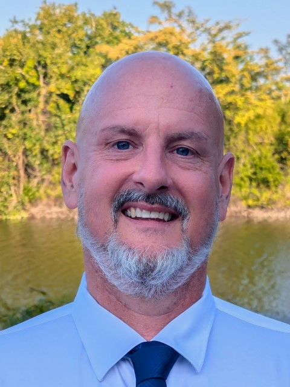

<button onclick="document.querySelectorAll('section').forEach((e) => e.classList.toggle('invert'))">Toggle appearance</button>

---

# Intentional AI  
## Co-Creating the Future That We Want

---

## David Cobb

- 30+ years in Information Technology
   - Career path: helpdesk, web developer, dba, system administrator, cloud engineer
[todo:CROSSROADS, SOMETHING MORE]   
- 5 years focused on Azure Cloud:
  - Learning & Teaching, multiple certifications
  - Azure Generalist (Data & AI, Dev, Infra)
[todo:MORE UNKNOWN JOURNEY HERE]  
- Current Focus:
  - Exploring & Applying AI toward optimized learning
  - Teaching Clients & Community in South Florida User Groups

---

# Today's Talk

- These are only possibilities & perspectives, no claim of truth!
- Consider the ideas that serve or inspire you & leave the rest.
- I offer THREE REFRAMES, 3 alternate perspectives, that put you in the drivers seat of your future.
---

## How do you envision our future with AI? Pessimist or Optimist?

---

## Two Views of AI

PESSIMIST OR OPTIMIST?

---

!----|----|----|
| Using AI because I have to keep my job | or | Using AI to amplify work I enjoy | 
!----|----|----|

---

!----|----|----|
| AI will replace me | or | AI will enhance me |
!----|----|----|

---

!----|----|----|
| AI is a threat to creativity | or | AI is a catalyst for creativity |
!----|----|----|

---

!----|----|----|
| AI makes me less human | or | AI helps me be more human |
!----|----|----|

---

!----|----|----|
| AI is taking over | or | AI is empowering us |
!----|----|----|

---

> "The future isn't something that happens to us. It's something we create together."

---

---

## A Story of Possibility

100 years ago:
- No personal computers
- No internet
- No smartphones

Yet someone dared to imagine...

> "Every person could have a computer in their home."

They were called dreamers. Unrealistic. Impractical.

.png.png)

---

## The Ember of an Idea

You have something to express:
- A story that needs telling
- A tool that could help others
- A vision of what could be

But the voice says:
- "I don't have the skills"
- "I can't compete with the pros"
- "Who am I to try?"

---

## From Survival to Creation

### The Old Story
- "I need to protect my job"
- "I need to keep up"
- "I need to survive"

### The New Story
- "I can amplify my creativity"
- "I can explore my ideas"
- "I can create what matters"

---

## Your Crossroads Moment

🔄 We're at an inflection point:

**Path A:** Stay in survival mode
- Keep up with AI
- Protect what you have
- Watch others innovate

**Path B:** Embrace co-creation
- Partner with AI
- Express your vision
- Shape the future

**Path B:** Embrace co-creation
- Partner with AI
- Express your vision
- Shape the future

.png)

---

## That Ember Inside You

Remember that idea you had?
The one that made you think:
*"If only I could..."*

Now you can.

> "The best time to plant a tree was 20 years ago. The second best time is now."

What will you create?

---

Getting there means changing your thinking, your beliefs. Here are 3 reframes to consider.

---

## Reframe # 1 : AI as a Thought Partner, Not a Boss

🤝 From drudgery to **possibility**

💡 From control to **co-creation**

🎷 From  to **improvisation**

.png)

---

## Reframe # 2 : AI As Mirror rather than Machine

AI is a Mirror of Our Mindset:

- Software rules apply: garbage in, garbage out.
- Our fears manifest as limitations, but curiosity unlocks possibilities
- When we change how we see ourselves, we change what's possible with AI.

💭 "The mirror of the heart must be polished before it can reflect the light."

---

## Prompt Example

🧪 "I have a dream to build _____, but I am blocked by fear of _______. I believe in _______. Talk me through seeing this fear as the path to my dream. "

➡️ Iterate. Refine. Publish.

---

# Reframe # 3 - AI As Creativity, not Control

Fear: "AI is taking control"
Freedom: "AI gives me freedom to create what I envision"

---

## Final Reflection

🤔 *What's still unexpressed in you?*

🛠️ *What could you build now that was once out of reach?*

---

## Q&A + Closing

🙋‍♀️ What's one thing you could now create with AI?  
🤝 Let's co-create the future — with **intention**, **curiosity**, and **heart**.

**Thank you!**

---

## Stay Connected! 📬

### Dave's Possibilities Email List 

## Upcoming Azure AI Events in April
- Microsoft AI SkillFest
- Global AI Bootcamp

✉️ **Sign up for email event updates:**  
[bit.ly/azure-ai-events](http://bit.ly/azure-ai-events)

## Let's Connect! 🤝

### Ready to explore AI possibilities?
- Connect with me on [LinkedIn](https://linkedin.com/in/davidcobb)
- Book a [virtual coffee chat](https://calendly.com/your-link)

Let's discuss your next technical, creative, or professional step!

---

Survival: "AI will replace my skills"
Soul: "AI can help me express my soul's purpose"

---
